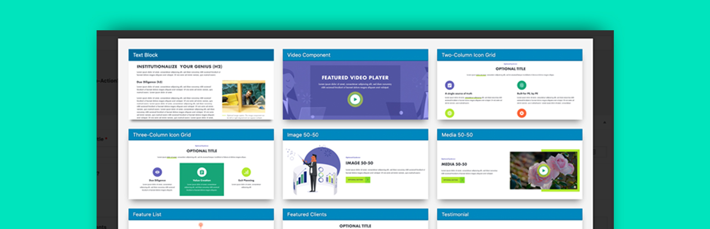
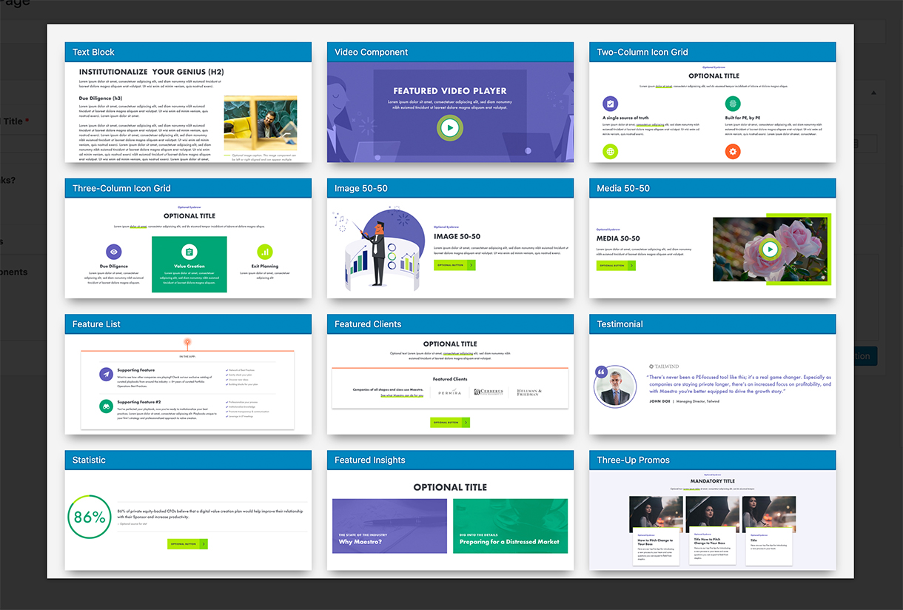

# Flexible Content Preview for Advanced Custom Fields

Transforms ACF's flexible content field's layout list into a modal with image previews.

## Image Conventions

* The size of the image should be 732 x 300.
* They should be named based on the layout's name (`text_block`) with underscores converted to dashes (`text-block.jpg`).

## Image Location

Images should be placed in your theme. By default, images are located here: `THEME/lib/admin/images/acf-flexible-content-preview`.

Also note that you can filter this path, but it **MUST** be in your theme:

`add_filter( 'acf-flexible-content-preview.images_path', $path );`

**NOTE:** The path should not have a trailing beginning or trailing slash!

Additionally, you could filter all keys and/or images:

`add_filter( 'acf-flexible-content-preview.images', $images );`

# Requirements

- [ACF Pro >= 5.7.O](https://www.advancedcustomfields.com/) plugin
- WordPress 4.7+ because of `[get_theme_file_uri()](https://developer.wordpress.org/reference/functions/get_theme_file_uri)`
- PHP 5.6+

# Installation

## [Composer](http://composer.rarst.net/)

- Add repository source : `{ "type": "vcs", "url": "https://github.com/jameelmoses/acf-flexible-content-preview" }`.
- Include `"acf-flexible-content-preview": "dev-master"` in your composer file for last master's commits or a tag released.
- Then add your awesome layout images.

## Contributing

Please refer to the [contributing guidelines](.github/CONTRIBUTING.md) to increase the chance of your pull request to be merged and/or receive the best support for your issue.

### Issues & Feature Requests

If you identify any errors or have an idea for improving the plugin, feel free to open an [issue](../../issues/new) or [create a pull request](../../compare). Please provide as much info as needed in order to help us resolving / approve your request.

## License

Flexible Content Preview for Advanced Custom Fields is licensed under the [GPLv3 or later](LICENSE.md).
